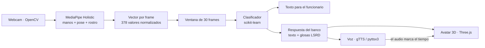

# 🤟 AccesoVivo — Ventanilla bancaria inclusiva

**Pantalla inteligente para la atención a personas sordas en sucursales bancarias de República Dominicana.**
Traduce la Lengua de Señas Dominicana (LSRD) a texto en tiempo real y responde con un **avatar 3D** que signa,
con **voz y subtítulos sincronizados**.


> ⚠️ **Prototipo (MVP).** El léxico de señas y el modelo de reconocimiento son demostrativos. Antes de un piloto real
> deben validarse con intérpretes y con la comunidad Sorda dominicana. Ver [Limitaciones](#-limitaciones).

---

## ✨ Funcionalidades

| Opción en pantalla | Qué hace |
|---|---|
| **Intérprete de señas (vía cámara)** | La cámara capta al cliente, MediaPipe extrae los puntos de manos, cuerpo y rostro, y un modelo de scikit-learn reconoce la seña (*Depósito*, *Retiro*, *Ayuda*). El funcionario la ve como texto y el avatar responde automáticamente. |
| **Traducir voz a señas** | El funcionario escribe o elige una frase y el avatar la signa en LSRD mientras se escucha en voz alta. |
| **Solicitar intérprete / lectura fácil** | Solicitud de intérprete humano (simulada) y explicación del trámite en lenguaje sencillo, leída y signada. |

- 🔒 **Procesamiento local:** el video de la cámara no sale del equipo.
- 🗣️ **Audio sincronizado:** el avatar ajusta el ritmo de sus señas a la duración real del audio.
- 😊 **Expresiones faciales:** cejas, mirada y boca acompañan cada seña (en LSRD son parte de la gramática).
- 🧍‍♀️ **Avatar intercambiable:** cualquier modelo `.glb` con esqueleto Mixamo; sin él se usa un maniquí 3D incluido.

## 🏗️ Arquitectura



**Reconocimiento.** Cada frame se convierte en un vector de 378 valores (pose, ambas manos y 40 puntos faciales),
normalizado respecto a los hombros para que no dependa de la distancia a la cámara. Cada ventana de 30 frames se
resume en estadísticas temporales (media, desviación, extremos, desplazamiento, velocidad) y se clasifica.
Una seña se confirma solo si se repite en varias predicciones seguidas con al menos 75 % de confianza.

**Avatar.** Las señas se describen en [`data/lexicon_lsrd.json`](data/lexicon_lsrd.json): ubicación de la mano,
orientación de la palma, forma de los dedos y expresión facial. El navegador calcula el movimiento de los brazos
(cinemática inversa), así que el mismo léxico sirve para cualquier avatar. Se eligió Three.js dentro de Streamlit
en lugar de videos pre-grabados o de una API externa porque permite componer cualquier respuesta sin grabar nada,
no tiene costo por uso y no envía datos de clientes a terceros.

## 📁 Estructura

```
├── 1_capture_data.py        # Script 1 · captura de señas con la webcam
├── 2_train_model.py         # Script 2 · entrenamiento y exportación del modelo
├── app.py                   # Script 3 · interfaz de la ventanilla (Streamlit)
├── config.py                # Señas, umbrales, respuestas del banco, frases rápidas
├── core/
│   ├── landmarks.py         # MediaPipe (API clásica y Tasks), vectores, features
│   ├── tts.py               # Síntesis de voz con caché y tiempos por palabra
│   ├── avatar.py            # Texto → glosas → guion del avatar
│   └── avatar_player.html   # Reproductor Three.js (avatar, rostro, audio)
├── data/lexicon_lsrd.json   # Léxico de señas del avatar
├── static/                  # Coloca aquí avatar.glb (opcional)
└── requirements.txt
```

## 🚀 Instalación

Requisitos: **Windows, macOS o Linux**, **Python 3.12 o 3.13** y una **webcam** (solo para reconocer señas).

```bash
git clone https://github.com/<tu-usuario>/AccesoVivo.git
cd AccesoVivo
python -m venv .venv
```

Activa el entorno (Windows: `.venv\Scripts\activate` · macOS/Linux: `source .venv/bin/activate`) e instala:

```bash
pip install -r requirements.txt
```

<details>
<summary>Nota sobre versiones de MediaPipe</summary>

MediaPipe 0.10.31 y posteriores eliminaron la API clásica `mp.solutions`. El proyecto funciona con ambas:

- **Python 3.12 + `mediapipe==0.10.21`:** usa `mp.solutions.holistic` (la opción más probada).
- **Python 3.13 + MediaPipe ≥ 0.10.31:** usa la API Tasks (`HolisticLandmarker`). Los modelos (~14 MB) se descargan
  en `models/mediapipe/` la primera vez.

Captura, entrena y ejecuta la app **con el mismo entorno**; la app avisa si el modelo se entrenó con otro.
</details>

## ▶️ Uso

### 1. Ver la demo sin cámara

```bash
streamlit run app.py
```

Abre http://localhost:8501, entra en **Traducir voz a señas**, elige una frase y pulsa **Signar y hablar**.

### 2. Entrenar el reconocimiento con tus señas

**Capturar** (cierra antes cualquier programa que use la cámara):

```bash
python 1_capture_data.py --sequences 30
```

| Tecla | Acción |
|---|---|
| `1` `2` `3` | Elegir seña (Depósito, Retiro, Ayuda) |
| `ESPACIO` | Grabar en automático: haz la seña en cada cuenta regresiva |
| `BACKSPACE` | Borrar la última muestra |
| `Q` | Salir y generar `data/dataset.npz` |

**Entrenar:**

```bash
python 2_train_model.py
```

Compara Regresión Logística, SVM y Random Forest con validación cruzada, muestra el reporte y la matriz de confusión,
y exporta el mejor a `models/lsd_classifier.joblib`. Sin cámara, `python 2_train_model.py --synthetic` valida el
pipeline con datos sintéticos (no reconoce señas reales).

**Probar:** vuelve a lanzar `streamlit run app.py`, entra en **Intérprete de señas (vía cámara)**, activa la cámara
y haz una seña.

### Consejos

- Buena luz de frente, torso y manos visibles. Graba con varias personas y distintas ropas y distancias.
- Si la detección es inestable, graba más muestras o ajusta `CONF_THRESHOLD` en [`config.py`](config.py).
- Nuevas señas o respuestas: añádelas en `config.py` (`SIGNS`, `BANK_RESPONSES`) y en el léxico del avatar.

## 🧍‍♀️ Avatar 3D personalizado

Coloca un modelo en `static/avatar.glb` y reinicia la app. Debe tener:

- **Esqueleto Mixamo** (`RightArm`, `RightForeArm`, `RightHand`, `RightHandIndex1`…; el prefijo `mixamorig` se ignora).
- **Blendshapes ARKit** (`browInnerUp`, `mouthSmileLeft`, `jawOpen`…) para las expresiones faciales.
- Orientación mirando hacia +Z (lo habitual en Mixamo y Ready Player Me).

Si el archivo no existe o le faltan huesos, se usa el maniquí incluido.

### Modo quiosco

Chrome puede bloquear el audio automático (el avatar muestra un botón ▶ de respaldo). En una pantalla dedicada:

```bash
chrome --kiosk --autoplay-policy=no-user-gesture-required http://localhost:8501
```

## ⚠️ Limitaciones

- **Léxico aproximado:** las señas y expresiones del avatar son demostrativas y deben validarlas intérpretes y la
  comunidad Sorda dominicana (p. ej., ANSORDO).
- **Modelo de prueba de concepto:** 3 señas estáticas por ventana de 1 s. En producción se necesitan datos de muchas
  personas, más vocabulario y un modelo secuencial (GRU/LSTM/Transformer).
- **Español → señas por diccionario:** las palabras sin seña en el léxico se omiten.
- **Cámara local:** la app usa la cámara del equipo donde corre Streamlit (válido para un quiosco). Para uso remoto,
  migrar a `streamlit-webrtc`.
- **Voz:** gTTS requiere internet; sin conexión se usa pyttsx3 con las voces del sistema.

## 🗺️ Próximos pasos

- [ ] Grabar a intérpretes nativos y convertir sus movimientos en animaciones del avatar.
- [ ] Ampliar el vocabulario bancario y reconocer frases completas.
- [ ] Traducción español → LSRD validada por expertos.
- [ ] Transcripción de voz del funcionario (speech-to-text).
- [ ] Pruebas de usabilidad con personas sordas.

## 🔐 Privacidad

Los videos no se guardan. Las capturas de entrenamiento (`data/raw/`, `data/dataset.npz`) contienen puntos del
cuerpo y del rostro de personas: están excluidas de Git por `.gitignore` y deben tratarse como datos personales.

## 📄 Licencia

Pendiente de definir por el autor.
